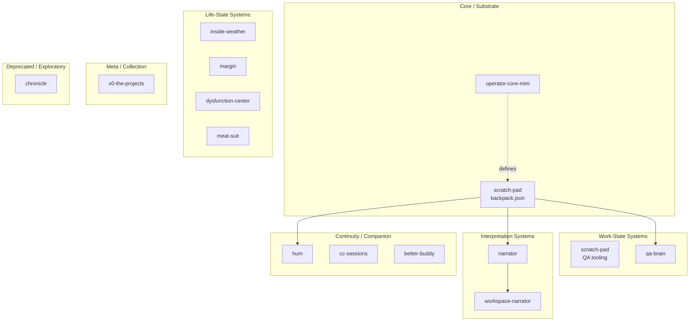

# Snackdriven Projects



```
Snackdriven Projects
│
├── Core / Substrate
│   ├── operator-core-mini   design docs for the memory ecology
│   └── scratch-pad          backpack.json lives here; active carry-state source
│
├── Work-State Systems
│   ├── scratch-pad          QA workflow tooling and work artifact source
│   └── qa-brain             local QA dashboard: ticket queue, test plans, backpack feed
│
├── Interpretation Systems
│   ├── narrator             file-based narrator and memory vault
│   └── workspace-narrator   adaptive narrator with theme/role/runtime logic
│
├── Continuity / Companion Systems
│   ├── hum                  Claude Code memory layer: session continuity, token optimization
│   ├── cc-sessions          Claude Code extension set: hooks, subagents, task infra
│   └── better-buddy         terminal companion for Claude Code
│
├── Life-State Systems
│   ├── inside-weather       mood, habit, and task tracker
│   ├── margin               chatbot that builds your journal while you talk
│   ├── dysfunction-center   executive dysfunction productivity platform
│   └── meat-suit            zero-demand journaling companion for AUDHD/PDA brains
│
├── Meta / Collection
│   └── v0-the-projects      Executive Dysfunction Center v0; early prototype cluster
│
└── Deprecated / Exploratory
    └── chronicle            local memory infrastructure experiment; replaced by Backpack in practice
```

---

## Full inventory

### QA & work tools

| Repo | Visibility | Description |
|------|-----------|-------------|
| qa-brain | private | Local QA dashboard: ticket queue, test plans, backpack feed, live file watching |
| qa-toolkit | private | Scripts built when the manual version got annoying enough |
| scratch-pad | private | QA workflow tooling and automation |
| jira-local | private | Jira, but bearable |
| jira-wrapper | private | Single-user Jira filter viewer with list, board, table, timeline views |
| riff-tracks | private | Dashboard for tracking what shipped |
| projects-dashboard | private | Launch and monitor all local dev projects from one place |

### Life systems

| Repo | Visibility | Description |
|------|-----------|-------------|
| inside-weather | private | Whimsical mood, habit, and task tracker |
| inside-weather-android | public | Inside Weather for Android — offline-first, on-device SQLite, no account needed |
| margin | public | Chatbot that builds your journal while you talk |
| margination | private | The journal that writes itself in the corner |
| meat-suit | private | Zero-demand journaling companion for AUDHD/PDA/alexithymia brains |
| meh-trics | private | Mood, habit, task, and journal tracker for chaotic goblin lifestyles |
| moodium | private | — |
| livejournal-clone | private | Private journaling with mood tracking, templates, Spotify now-playing. Local storage only |

### Productivity & executive function

| Repo | Visibility | Description |
|------|-----------|-------------|
| dysfunction-center | private | Productivity platform for executive dysfunction: tasks, habits, mood, journal, calendar |
| v0-the-projects | private | Executive Dysfunction Center v0 with Google sync |
| nibble | private | A planner that actually gets used. Tasks, events, subtasks, cross-device sync |
| task-manager | private | Todoist/TickTick hybrid with React, TypeScript, Tailwind |
| plush-galaxy | private | Daybeam: ADHD-focused productivity with progressive disclosure |
| daybeam-app | private | Daybeam app (Leap-generated base) |
| ATLAS | private | Adaptive learning and learning analysis system |

### Claude & AI tools

| Repo | Visibility | Description |
|------|-----------|-------------|
| hum | private | Claude Code memory layer: session continuity, frustration detection, token optimization |
| cc-sessions | private | Opinionated Claude Code extension set: hooks, subagents, commands, task/git infra |
| better-buddy | public | Terminal companion for Claude Code |
| roux | private | Local Ollama-powered personal assistant |
| awesome-claude-skills | private | Curated list of Claude Skills |
| skills | private | Public repository for Skills |
| memory-shack | private | — |

### Fun & experiments

| Repo | Visibility | Description |
|------|-----------|-------------|
| bad-movie-bracket | public | 32 movies that have no business existing. One bracket. |
| disney-bracket | public | 70 Disney & Pixar movies. One bracket. No good choices. |
| slow-burn | public | You and Claude pass a story, each seeing only the last few lines |
| lastfm-clone | private | Tracks Spotify history and now-playing. All data stored locally in the browser |
| google-calendar-clone | private | Single-user Google Calendar clone with two-way sync |
| snack-blitz | private | — |
| dreamy-ping | private | FMBM — but not exclusively |
| softspell | private | — |

### Windows tools

| Repo | Visibility | Description |
|------|-----------|-------------|
| AudioBand | private | Display and control songs from the Windows taskbar |
| EarTrumpet | private | Volume control for Windows |
| SylphyHornPlusWin11 | private | Virtual desktop tools for Windows 11 and 10 |

### Personal

| Repo | Visibility | Description |
|------|-----------|-------------|
| portfolio | public | "I find bugs for money and introduce them for fun." |
| saveTheDate | private | Gothic save-the-date for the March 2026 Crescent Hotel wedding |
| weddingHub | private | Wedding coordinator dashboard: guests, vendors, budget |

### Dev infrastructure & templates

| Repo | Visibility | Description |
|------|-----------|-------------|
| react-ts-templates | private | Shared templates and configs for React 18 + TypeScript + Vite |
| specs_and_prds | private | Shared templates and PRDs for React + TypeScript projects |
| docker-orchestrator | private | Docker container orchestration and management tools |
| bettervoid | private | — |
| email-to-sheet | private | — |
| docs | private | MDX docs |

### Forks & misc

| Repo | Visibility | Description |
|------|-----------|-------------|
| freeCodeCamp | private | freeCodeCamp open-source codebase fork |
| big-list-of-naughty-strings | private | Strings with high probability of causing issues as user input |
| ferdi | private | Multi-app organizer |
| catering | private | — |
| cateringCost | private | Catering cost calculator, deployed via GitHub Pages |
| starred | private | Curated list of GitHub stars |
| johnny-decimal-obsidian | private | Obsidian plugin |
| notionesque-obsidian | private | Obsidian plugin |
| single-folder-obsidian | private | Obsidian plugin |
| clumsy-robot | private | — |
| uncanny-cupcake | private | — |
| playwright-but-play | private | — |
