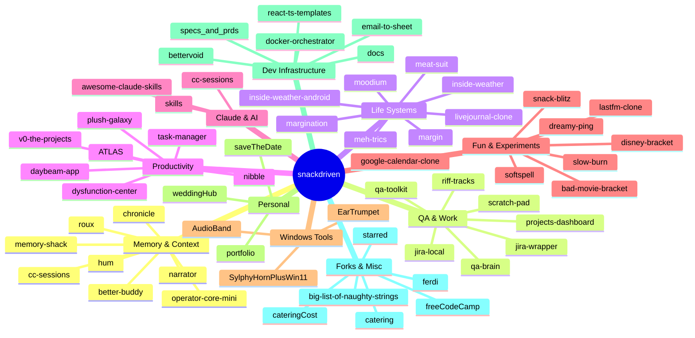

# snackdriven repos

All repos across the organization, grouped by cluster.

---

## Memory & context

The side-brain cluster. Tools for carrying context forward, persisting memory, and bootstrapping assistants.

| Repo | Visibility | Description |
|------|-----------|-------------|
| [operator-core-mini](https://github.com/snackdriven/operator-core-mini) | public | Design docs for the Backpack / Doctrine / Hoard memory ecology |
| [chronicle](https://github.com/snackdriven/chronicle) | public | Local memory infrastructure experiment (deprecated in practice) |
| [hum](https://github.com/snackdriven/hum) | private | Claude Code memory layer: session continuity, frustration detection, token optimization |
| [narrator](https://github.com/snackdriven/narrator) | public | File-based narrator/memory vault system |
| [roux](https://github.com/snackdriven/roux) | private | Local Ollama-powered personal assistant |
| [cc-sessions](https://github.com/snackdriven/cc-sessions) | private | Opinionated Claude Code extension set: hooks, subagents, commands, task/git infra |
| [better-buddy](https://github.com/snackdriven/better-buddy) | public | Terminal companion for Claude Code |
| [memory-shack](https://github.com/snackdriven/memory-shack) | private | — |

---

## QA & work tools

Tools built for day-to-day QA and engineering workflow.

| Repo | Visibility | Description |
|------|-----------|-------------|
| [qa-brain](https://github.com/snackdriven/qa-brain) | private | Local QA dashboard: ticket queue, test plan viewer, backpack feed, live file watching |
| [qa-toolkit](https://github.com/snackdriven/qa-toolkit) | private | Scripts built when the manual version got annoying enough |
| [scratch-pad](https://github.com/snackdriven/scratch-pad) | private | QA workflow tooling and automation |
| [jira-local](https://github.com/snackdriven/jira-local) | private | Jira, but bearable |
| [jira-wrapper](https://github.com/snackdriven/jira-wrapper) | private | Single-user Jira filter viewer with list, board, table, timeline views |
| [riff-tracks](https://github.com/snackdriven/riff-tracks) | private | Dashboard for tracking what shipped |
| [projects-dashboard](https://github.com/snackdriven/projects-dashboard) | private | Launch and monitor all local dev projects from one place |

---

## Life systems

Mood, habit, journal, and self-observation tools.

| Repo | Visibility | Description |
|------|-----------|-------------|
| [inside-weather](https://github.com/snackdriven/inside-weather) | private | Whimsical mood, habit, and task tracker |
| [inside-weather-android](https://github.com/snackdriven/inside-weather-android) | public | Inside Weather for Android — offline-first, on-device SQLite, no account needed |
| [margin](https://github.com/snackdriven/margin) | public | Chatbot that builds your journal while you talk |
| [margination](https://github.com/snackdriven/margination) | private | The journal that writes itself in the corner |
| [meat-suit](https://github.com/snackdriven/meat-suit) | private | Zero-demand journaling companion for AUDHD/PDA/alexithymia brains |
| [meh-trics](https://github.com/snackdriven/meh-trics) | private | Mood, habit, task, and journal tracker for chaotic goblin lifestyles |
| [moodium](https://github.com/snackdriven/moodium) | private | — |
| [livejournal-clone](https://github.com/snackdriven/livejournal-clone) | private | Private journaling with mood tracking, templates, Spotify now-playing. Local storage only |

---

## Productivity & executive function

Task management, planning, and anti-executive-dysfunction tools.

| Repo | Visibility | Description |
|------|-----------|-------------|
| [dysfunction-center](https://github.com/snackdriven/dysfunction-center) | private | Productivity platform for executive dysfunction: tasks, habits, mood, journal, calendar |
| [v0-the-projects](https://github.com/snackdriven/v0-the-projects) | private | Executive Dysfunction Center v0 with Google sync |
| [nibble](https://github.com/snackdriven/nibble) | private | A planner that actually gets used. Tasks, events, subtasks, cross-device sync |
| [task-manager](https://github.com/snackdriven/task-manager) | private | Todoist/TickTick hybrid with React, TypeScript, Tailwind |
| [plush-galaxy](https://github.com/snackdriven/plush-galaxy) | private | Daybeam: ADHD-focused productivity with progressive disclosure |
| [daybeam-app](https://github.com/snackdriven/daybeam-app) | private | Daybeam app (Leap-generated base) |
| [ATLAS](https://github.com/snackdriven/ATLAS) | private | Adaptive learning and learning analysis system |

---

## Claude & AI tools

Skills, companions, and Claude Code extensions.

| Repo | Visibility | Description |
|------|-----------|-------------|
| [awesome-claude-skills](https://github.com/snackdriven/awesome-claude-skills) | private | Curated list of Claude Skills |
| [skills](https://github.com/snackdriven/skills) | private | Public repository for Skills |
| [cc-sessions](https://github.com/snackdriven/cc-sessions) | private | Claude Code extension set (also in Memory & Context) |
| [better-buddy](https://github.com/snackdriven/better-buddy) | public | Terminal companion for Claude Code (also in Memory & Context) |

---

## Fun & experiments

Side projects, brackets, creative tools.

| Repo | Visibility | Description |
|------|-----------|-------------|
| [bad-movie-bracket](https://github.com/snackdriven/bad-movie-bracket) | public | 32 movies that have no business existing. One bracket. |
| [disney-bracket](https://github.com/snackdriven/disney-bracket) | public | 70 Disney & Pixar movies. One bracket. No good choices. |
| [slow-burn](https://github.com/snackdriven/slow-burn) | public | You and Claude pass a story, each seeing only the last few lines |
| [lastfm-clone](https://github.com/snackdriven/lastfm-clone) | private | Tracks Spotify history and now-playing. All data stored locally in the browser |
| [google-calendar-clone](https://github.com/snackdriven/google-calendar-clone) | private | Single-user Google Calendar clone with two-way sync |
| [snack-blitz](https://github.com/snackdriven/snack-blitz) | private | — |
| [dreamy-ping](https://github.com/snackdriven/dreamy-ping) | private | FMBM — but not exclusively |
| [softspell](https://github.com/snackdriven/softspell) | private | — |

---

## Windows tools

| Repo | Visibility | Description |
|------|-----------|-------------|
| [AudioBand](https://github.com/snackdriven/AudioBand) | private | Display and control songs from the Windows taskbar |
| [EarTrumpet](https://github.com/snackdriven/EarTrumpet) | private | Volume control for Windows |
| [SylphyHornPlusWin11](https://github.com/snackdriven/SylphyHornPlusWin11) | private | Virtual desktop tools for Windows 11 and 10 |

---

## Personal

| Repo | Visibility | Description |
|------|-----------|-------------|
| [portfolio](https://github.com/snackdriven/portfolio) | public | "I find bugs for money and introduce them for fun." |
| [saveTheDate](https://github.com/snackdriven/saveTheDate) | private | Gothic save-the-date for the March 2026 Crescent Hotel wedding |
| [weddingHub](https://github.com/snackdriven/weddingHub) | private | Wedding coordinator dashboard: guests, vendors, budget |

---

## Dev infrastructure & templates

| Repo | Visibility | Description |
|------|-----------|-------------|
| [react-ts-templates](https://github.com/snackdriven/react-ts-templates) | private | Shared templates and configs for React 18 + TypeScript + Vite |
| [specs_and_prds](https://github.com/snackdriven/specs_and_prds) | private | Shared templates and PRDs for React + TypeScript projects |
| [docker-orchestrator](https://github.com/snackdriven/docker-orchestrator) | private | Docker container orchestration and management tools |
| [bettervoid](https://github.com/snackdriven/bettervoid) | private | — |
| [email-to-sheet](https://github.com/snackdriven/email-to-sheet) | private | — |
| [docs](https://github.com/snackdriven/docs) | private | MDX docs |

---

## Forks & misc

| Repo | Visibility | Description |
|------|-----------|-------------|
| [freeCodeCamp](https://github.com/snackdriven/freeCodeCamp) | private | freeCodeCamp open-source codebase fork |
| [big-list-of-naughty-strings](https://github.com/snackdriven/big-list-of-naughty-strings) | private | Strings with high probability of causing issues as user input |
| [ferdi](https://github.com/snackdriven/ferdi) | private | Multi-app organizer |
| [catering](https://github.com/snackdriven/catering) | private | — |
| [cateringCost](https://github.com/snackdriven/cateringCost) | private | Catering cost calculator, deployed via GitHub Pages |
| [starred](https://github.com/snackdriven/starred) | private | Curated list of GitHub stars |
| [johnny-decimal-obsidian](https://github.com/snackdriven/johnny-decimal-obsidian) | private | Obsidian plugin |
| [notionesque-obsidian](https://github.com/snackdriven/notionesque-obsidian) | private | Obsidian plugin |
| [single-folder-obsidian](https://github.com/snackdriven/single-folder-obsidian) | private | Obsidian plugin |
| [clumsy-robot](https://github.com/snackdriven/clumsy-robot) | private | — |
| [uncanny-cupcake](https://github.com/snackdriven/uncanny-cupcake) | private | — |
| [playwright-but-play](https://github.com/snackdriven/playwright-but-play) | private | — |
